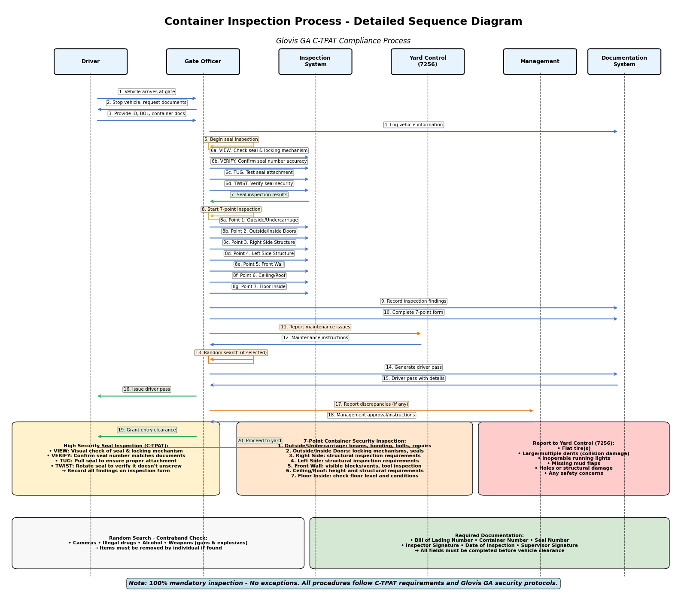

# Hyun Project

여기서는 Streamlit과 Knowledge Base를 이용하여 strands agent 기반의 chatbot을 구현합니다. 전체적인 architecture는 아래와 같습니다. MCP server로 Knowledge Base, Code Interpreter를 이용하고 strands agent를 이용해 관련된 문서를 조회하여 답변을 구하고 필요하다면 다이어그램을 그래서 이해를 돕습니다. 여기서 생성된 agent는 streamlit을 이용해 UI를 제공하고 ALB와 CloudFront를 이용하여 안전하게 활용할 수 있습니다.


## 주요 구현

### Strands Agent

[agent.py](./application/agent.py)와 같이 app에서 agent를 실행하면 아래와 같이 run_agent가 실행됩니다. 이때 최초 실행이 되면 아래와 같이 initialize_agent()로 agent를 생성합니다. mcp_client가 준비가 되면 아래와 같이 agent를 [stream_async](https://strandsagents.com/latest/documentation/docs/user-guide/concepts/streaming/async-iterators/)을 이용해 실행됩니다. Strands agent는 하나의 입력을 multi-step reasoning을 통해 답을 찾아가므로 중간의 출력들을 아래와 같이 show_streams으로 보여줍니다. 

```python
async def run_agent(query: str, containers):
    global index, status_msg
    global agent, mcp_client, tool_list
    
    if agent is None:
        agent, mcp_client, tool_list = initialize_agent()

    with mcp_client as client:
        agent_stream = agent.stream_async(query)
        result = await show_streams(agent_stream, containers)
    return result
```

[mcp.json](./application/mcp.json)에서는 MCP 서버에 대한 정보를 가지고 있습니다. 이 정보를 이용하여 MCPClient를 생성할 수 있습니다. mcp.json의 MCP 서버의 정보인 command, args, env를 이용해 [StdioServerParameters](https://github.com/strands-agents/sdk-python?tab=readme-ov-file#mcp-support)를 구성합니다.

```python
def create_mcp_client(mcp_server_name: str):
    config = load_mcp_config()
    mcp_servers = config["mcpServers"]
    
    mcp_client = None
    for server_name, server_config in mcp_servers.items():
        env = server_config["env"] if "env" in server_config else None

        if server_name == mcp_server_name:
            mcp_client = MCPClient(lambda: stdio_client(
                StdioServerParameters(
                    command=server_config["command"], 
                    args=server_config["args"], 
                    env=env
                )
            ))
            break
    
    return mcp_client
```

아래와 같이 "knowledge_base"를 사용하는 MCP agent를 아래와 같이 create_mcp_client로 생성합니다. 또한 [list_tools_sync](https://github.com/strands-agents/sdk-python?tab=readme-ov-file#mcp-support)를 이용해 tool에 대한 정보를 가져와서 tools에 추가합니다. 이후 아래와 같이 agent를 생성합니다.

```python
def initialize_agent():
    """Initialize the global agent with MCP client"""
    mcp_client = create_mcp_client("knowledge_base")
        
    # Create agent within MCP client context manager
    with mcp_client as client:
        mcp_tools = client.list_tools_sync()        
        tools = []
        tools.extend(mcp_tools)
        tool_list = get_tool_list(tools)    
        system_prompt = (
            "당신의 이름은 현민이고, 질문에 대해 친절하게 답변하는 사려깊은 인공지능 도우미입니다."
            "상황에 맞는 구체적인 세부 정보를 충분히 제공합니다." 
            "모르는 질문을 받으면 솔직히 모른다고 말합니다."
        )
        model = get_model()
        agent = Agent(
            model=model,
            system_prompt=system_prompt,
            tools=tools,
            conversation_manager=conversation_manager
        )
    
    return agent, mcp_client, tool_list
```

여러개의 MCP 서버를 사용할 경우에는 [multi_mcp_agent.py](./application/multi_mcp_agent.py)을 참조합니다. 여기에서는 아래와 같이 knowledge_base_mcp_client와 repl_coder_client를 이용해 mcp client를 생성하고 mcp_tools를 extend해서 활용하여야 합니다. 

```python
def initialize_agent():
    """Initialize the global agent with MCP client"""
    knowledge_base_mcp_client = create_mcp_client("knowledge_base")
    repl_coder_client = create_mcp_client("repl_coder")
        
    # Create agent within MCP client context manager
    with knowledge_base_mcp_client, repl_coder_client:
        mcp_tools = knowledge_base_mcp_client.list_tools_sync()
        mcp_tools.extend(repl_coder_client.list_tools_sync())
```        

### MCP Servers

[mcp_retrieve.py]에서는 Knowledge Base로부터 관련된 문서를 조회합니다. bedrock-agent-runtime로 client를 정의하고 retrieve를 이용해 질문과 관련된 문서를 조회합니다. 얻어진 문서에서 text와 url과 같은 정보를 추출합니다.

```python
bedrock_agent_runtime_client = boto3.client("bedrock-agent-runtime", region_name=bedrock_region)

def retrieve(query):
    response = bedrock_agent_runtime_client.retrieve(
        retrievalQuery={"text": query},
        knowledgeBaseId=knowledge_base_id,
            retrievalConfiguration={
                "vectorSearchConfiguration": {"numberOfResults": number_of_results},
            },
        )
    retrieval_results = response.get("retrievalResults", [])
    json_docs = []
    for result in retrieval_results:
        text = url = name = None
        if "content" in result:
            content = result["content"]
            if "text" in content:
                text = content["text"]

        if "location" in result:
            location = result["location"]
            if "s3Location" in location:
                uri = location["s3Location"]["uri"] if location["s3Location"]["uri"] is not None else ""
                
                name = uri.split("/")[-1]
                url = uri # TODO: add path and doc_prefix
                
            elif "webLocation" in location:
                url = location["webLocation"]["url"] if location["webLocation"]["url"] is not None else ""
                name = "WEB"

        json_docs.append({
            "contents": text,              
            "reference": {
                "url": url,                   
                "title": name,
                "from": "RAG"
            }
        })
```

[mcp_server_retrieve.py](./application/mcp_server_retrieve.py)에서는 아래와 같이 FastMCP를 이용해 Knowledge Base를 조회하는 MCP 기능을 구현합니다. 이때 retrieve라는 tool을 아래와 같이 정의할 수 있고 agent은 docstring을 참조하여 적절한 tool을 선택합니다. 


```python
from mcp.server.fastmcp import FastMCP 

mcp = FastMCP(
    name = "mcp-retrieve",
    instructions=(
        "You are a helpful assistant. "
        "You retrieve documents in RAG."
    ),
)

@mcp.tool()
def retrieve(keyword: str) -> str:
    """
    Query the keyword using RAG based on the knowledge base.
    keyword: the keyword to query
    return: the result of query
    """
    return mcp_retrieve.retrieve(keyword)

if __name__ =="__main__":
    print(f"###### main ######")
    mcp.run(transport="stdio")
```


## 설치 및 활용

### RAG 구현

[Knowledge Base](https://us-west-2.console.aws.amazon.com/bedrock/home?region=us-west-2#/knowledge-bases)에 접속해서 [Create]를 선택하여 RAG를 생성합니다. 완료가 되면 Knowledge Base의 ID를 확인합니다.

Amazon S3에 아래와 같이 파일을 업로드합니다. 


[Knowledge Base Console](https://us-west-2.console.aws.amazon.com/bedrock/home?region=us-west-2#/knowledge-bases)에 접속해서 생성한 Knowledge Bases를 선택한 후에 아래와 같이 sync를 선택합니다. Sync가 완료가 되면 [Test Knowledge Base]를 선택하여 정상적으로 문서 정보를 가져오는지 확인합니다. 


### Strands Agent의 활용

Strands agent는 multi-step reasoning을 통해 향상된 RAG 검색을 가능하게 해줍니다. 이를 활용하기 위해 먼저 아래와 같이 git으로 부터 소스를 가져옵니다.

```text
git clone https://github.com/kyopark2014/hyun-project
```

"application" 폴더의 [config.json](./application/config.json)을 선택한 후에 아래와 같이 knowledge_base_id를 업데이트 합니다. knowledge_base_id은 생성한 Knowledge Base의 ID입니다.

```java
{
    "projectName":"hyun-project",
    "region":"us-west-2",
    "knowledge_base_id":"O2IGZXMQXO"
 }
```

이제 필요한 패키지를 설치합니다.

```text
pip install streamlit streamlit-chat boto3 aioboto3 strands-agents strands-agents-tools mcp langchain_experimental
```

이후 아래와 같이 streamlit을 실행합니다.

```text
streamlit run application/app.py
```

죄측의 메뉴에서 사용하는 모델을 선택할 수 있으며, "Debug Mode"로 최종 결과와 전체 결과를 구분하여 확인할 수 있습니다. 

### 실행 결과

"Truck Gate의 Access Control에 대해 설명해주세요."라고 입력하면 아래와 같은 결과를 얻을 수 있습니다.


"컨테이너 검사 과정을 시퀀스 다이어그램으로 보여줘"라고 입력하며 아래와 같은 diagram을 생성할 수 있습니다.




